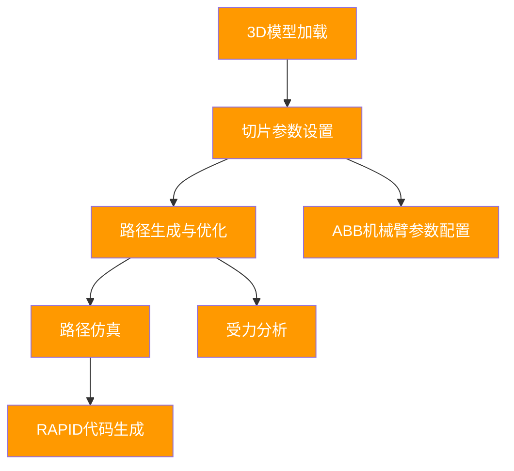
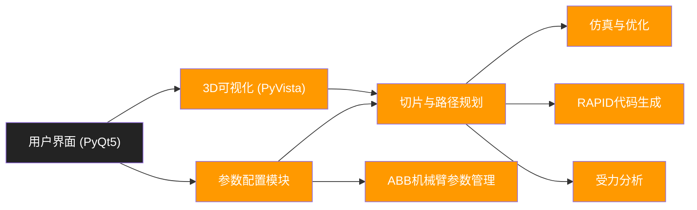

# 路径切片与仿真系统（支持ABB机械臂参数配置）

## 项目简介

本项目是一个面向工业应用的路径切片与仿真系统，专为ABB机械臂设计，支持STL和STEP文件格式，集成了3D模型加载、切片、路径规划、仿真、受力分析及RAPID代码生成等完整流程，并具备专业的ABB机械臂参数配置功能。系统采用现代化PyQt5界面，适用于焊接、加工、装配等多种工业场景。

---

## 主要功能
- **3D模型加载与显示**：支持STL/STEP格式，三角网格与包围盒可视化。
- **模型选择与方向调整**：旋转、缩放、位置控制，实时预览。
- **切片参数设置**：层高、网格间距、优化等级、方向、填充模式等。
- **路径生成与优化**：自动切片、路径碰撞检测、平滑处理、多线程优化。
- **路径仿真**：3D路径动画仿真，速度调节，进度显示。
- **RAPID代码生成**：标准ABB RAPID代码导出，模板自定义。
- **测量工具**：距离、角度、面积、体积测量。
- **ABB机械臂参数配置**：基础参数、TCP调整、运动控制、焊接工艺、安全、通信等六大标签页，支持多型号机器人。
- **受力分析**：基于有限元分析的应力分布、安全评估与报告导出。

### 项目核心流程图

本系统的典型工作流程如下：



---

## 安装与环境准备

### 1. Conda环境（推荐）
```bash
conda create -n weld python=3.8
conda activate weld
conda install pyqt pyvista trimesh numpy
conda install -c conda-forge pythonocc-core
```

### 2. 依赖包（如遇缺失可手动安装）
- numpy
- pandas
- matplotlib
- PyQt5
- trimesh
- pyvista
- pyvistaqt
- scipy
- pyqtgraph
- jinja2
- Pillow
- requests
- networkx
- pythonocc-core

或运行 `setup_environment.bat` 一键安装。

---

## 启动方法

### 方式一：批处理/脚本启动
- 双击 `quick_start.bat` 或 `start_system.bat`
- 或右键 `start_system.ps1` 选择“使用PowerShell运行”

### 方式二：命令行启动
```bash
python v3.py
```

---

## 文件结构
```
HXJS/
├── v3.py                      # 主程序入口
├── v4.py                      # 新版主程序（可选）
├── test_model_control.py      # 模型控制测试
├── test_abb_params.py         # ABB参数测试
├── demo_stress_analysis.py    # 受力分析演示
├── test_stress_analysis.py    # 受力分析测试
├── abb_welding_preset.json    # 焊接参数预设示例
├── quick_start.bat            # 快速启动脚本
├── start_system.bat           # 详细启动脚本
├── start_system.ps1           # PowerShell启动脚本
├── setup_environment.bat      # 环境配置脚本
├── README.md                  # 项目说明
├── *.md                       # 功能说明文档
└── ...
```

---

## 典型应用场景
- 工业焊接路径规划与仿真
- 机械臂参数配置与优化
- 结构受力分析与安全评估
- 3D模型切片与路径生成
- 工程教学与科研演示

---

## 系统架构图

下图展示了本系统的主要模块及其关系：



---

## 技术特点
- 现代化PyQt5界面，Ribbon风格操作
- 高性能3D可视化（PyVista）
- 多线程与异步处理，流畅体验
- 支持多种机器人型号与参数预设
- 模块化设计，易于扩展
- 完善的错误处理与用户反馈

---

## 贡献与许可

欢迎提交Issue与PR共同完善本项目。建议先阅读各功能说明文档。

本项目仅供学习与科研使用，禁止用于商业用途。

---

## 联系与支持

如有问题请查阅 `启动说明.md`、`功能补全总结.md` 或联系作者。

---

> © 2025 ZHY & Contributors. All rights reserved. 